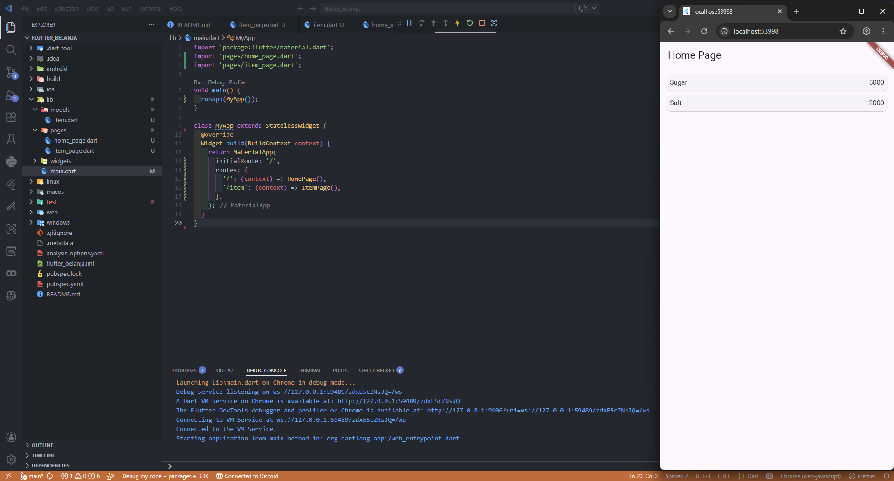

# flutter_belanja

A new Flutter project.

## Flutter Belanja - Navigasi

### Langkah 1-6

- Setup & Struktur → buat project Flutter dan rapikan folder (models, pages, widgets)
- Halaman & Data → buat HomePage, ItemPage, dan model Item (name, price)
- Routing & Tampilan → atur navigasi di main.dart dan tampilkan data pakai ListView
