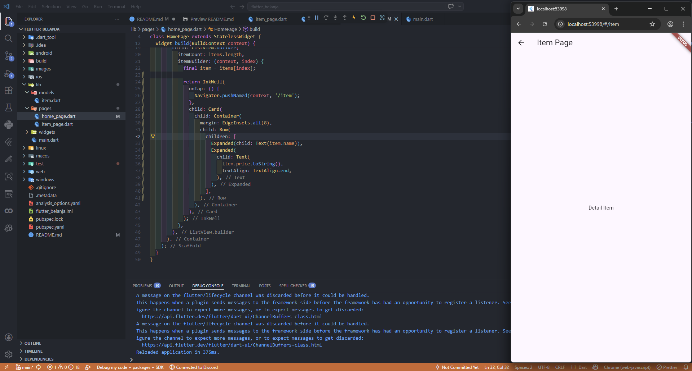
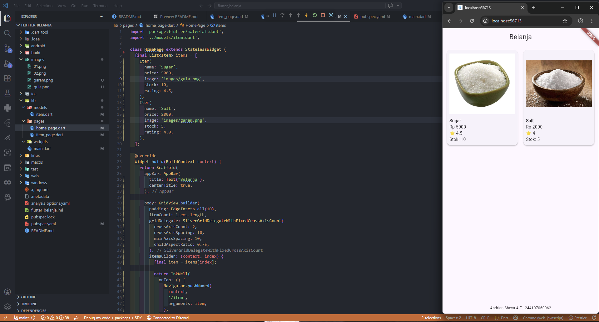

# flutter_belanja

A new Flutter project.

## Flutter Belanja - Navigasi

### Langkah 1-6

- Setup & Struktur → buat project Flutter dan rapikan folder (models, pages, widgets)
- Halaman & Data → buat HomePage, ItemPage, dan model Item (name, price)
- Routing & Tampilan → atur navigasi di main.dart dan tampilkan data pakai ListView

### Langkah 7

- Tambah InkWell
- Pindahkan Card ke dalam InkWell
- Tambah onTap → untuk navigasi ke /item

### Praktikum 2

- Tambahkan atribut foto produk, stok, dan rating. Ubahlah tampilan menjadi GridView seperti di aplikasi marketplace pada umumnya.